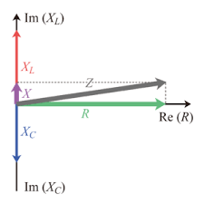

임피던스란, 전기회로에서 전기를 방해하는 요소다. 임피던스는 저항∙인덕턴스∙캐파시턴스로 구성된다. 직류에서는 오직 저항만이 전기를 방해하는 요소이나, 교류에서는 저항∙인덕턴스∙캐파시턴스가 모두 전기를 방행하는 요소다.

|구분|저항|인덕턴스|캐파시턴스|
|---|---|---|---|
|기능(직류)|전기방해|전기유도|전기저장|
|기능(교류)|전기방해|전기방해|전기방해|
|기호|R|L|C|
|단위(개별단위)|옴|헨리|패럿|
|단위($\Omega$)|R[$\Omega$]|$X_{L}[\Omega]=2\pi f L[\Omega]$|$X_{C}[\Omega]=\frac{1}{2\pi f L} [\Omega]$|

## V=IZ 법칙

직류에서 V=IR은 교류에서 V=IZ로 변하며, Z는 교류보다 복잡한 공식으로 결정된다. 

$$Z=R+j[X_{L}-X_{C}] \\
Z=R+j[2 \pi fL -\frac{1}{2\pi fC}]

$$
