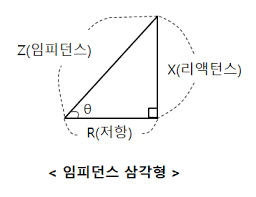

## 임피던스(Impendance)
임피던스란, 전기회로에서 전기를 방해하는 요소다. 임피던스는 저항∙인덕턴스∙캐파시턴스로 구성된다. 직류에서는 오직 저항만이 전기를 방해하는 요소이나, 교류에서는 저항∙인덕턴스∙캐파시턴스가 모두 전기를 방행하는 요소다.

|구분|저항|인덕턴스|캐파시턴스|
|---|---|---|---|
|기능(직류)|전기방해|전기유도|전기저장|
|기능(교류)|전기방해|전기방해|전기방해|
|기호|R|L|C|
|단위(개별 단위)|옴[$\Omega$]|헨리[H]|패럿[F]|
|단위($\Omega$)|옴[$\Omega$]|$X_{L}[\Omega]=2\pi f∙L[\Omega]$|$X_{C}[\Omega]=\frac{1}{2\pi f∙C} [\Omega]$|

 

## 리엑턴스(Reactance)

임피던스는 실수분인 저항(Resistance)와 허수분인 리액턴스(Reactance)로 나눈다. 리액턴스(Reactance)는 앞서 언급한 인덕턴스와 캐파시턴스를 포함한다. 

- 유도성 리액턴스 = 인덕턴스
- 용량성 리액턴스 = 캐파시턴스

리액턴스가 허수라 하면 리액턴스는 저항과 같이 전류를 직접적으로 방해하지 않고, 전류와 전압의 위상차를 발생함으로서 유효한 전력을 감소시키기 때문이다. 

따라서 임피던스는 저항의 제곱과 리액턴스의 제곱을 기준으로 결정할 수 있다. 

$$Z^2=R^2+X^2 \\
Z=\sqrt {R^2+X^2} \\
Z=\sqrt {R^2+ [{2 \pi fL -\frac{1}{2\pi fC}}]^2} \\
$$

